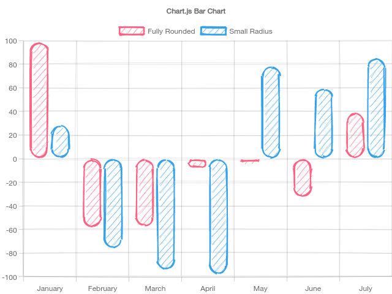

# chartjs-plugin-roughness



## Usage

### h5

```js
import 'chartjs-plugin-roughness'

new Chart(..., {
  ...,
  plugins: {
    roughness: {
      disabled: true // enable by default if imported chartjs-plugin-roughness
      // more rough options
    }
  }
})
```

### SSR

`@napi-rs/canvas` is supported for SSR, see [demo](demo/rs-canvas).

### Rough Options

See [rough options](https://github.com/rough-stuff/rough/wiki#options) for more options.

### Caution

- This package should be imported before `chart.js`.
- This package [override](./bar.element.patch.js) `BarElement.draw` method if roughness was enabled.
- This package [override](./filler.patch.js) `Filler` hooks for clearing stroke colors to prevent area border.
- This package [override](./context2d.patch.js) `beginPath`, `closePath`, `fill`, `stroke`, `moveTo`, `lineTo`, `arcTo`,
  `arc`, `quadraticCurveTo`, `rect`, `ellipse`, `bezierCurveTo` while roughness chart rendering. `ellipse` was **not**
  implemented by `roughjs`, you should provide your own polyfill if you want this feature.
- This package [override](./path2d.patch.js) `window.Path2D` class and should act same as original.
- This package [override](./tooltip.patch.js) `TooltupPlugin` class to skip drawing tooltip background using roughness.
  Set tooltip plugin option `preventSkipBackgroundRoughness` to `true` to prevent it.
